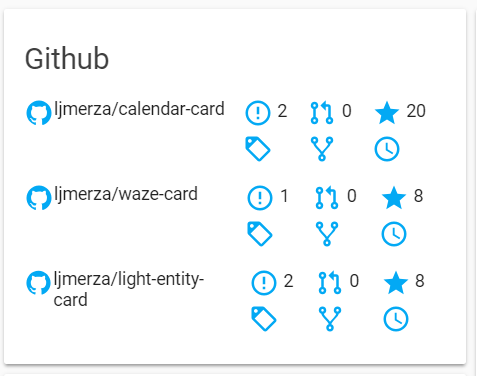

<h1 align="center">Github Card for Home Assistant</h1>

<p align="center">
  
</p>


<h2>Track Updates</h2>

This custom card can be tracked with the help of [custom-updater](https://github.com/custom-components/custom_updater).

In your configuration.yaml

```yaml
custom_updater:
  card_urls:
    - https://raw.githubusercontent.com/ljmerza/github-card/master/custom_updater.json
```

<h2>Options</h2>

| Name | Type | Requirement | `Default` Description
| ---- | ---- | ------- | -----------
| title | string | **Optional** | `Github` Change card title
| entities | list | **Required** | List of github sensors to display
| show_extended | boolean | **Optional** | `true` Show/hide tags, forks, and commits links

<h2>Configuration</h2>

Download `github-card.js` from the [latest release](https://github.com/ljmerza/github-card/releases/latest/) and upload it your /www folder of your Home Assistant config directory.

In your ui-lovelace.yaml

```yaml
resources:
  - url: /local//github-card.js?v=1.2.0
    type: js
```

Add the custom card to views:

```yaml
views:
  - type: custom:github-card
    entities:
    - sensor.calendar_card
    - sensor.waze_card
    - sensor.light_entity_card
```